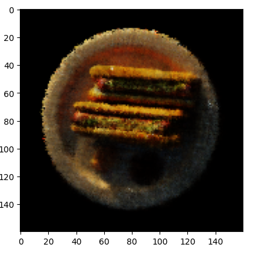
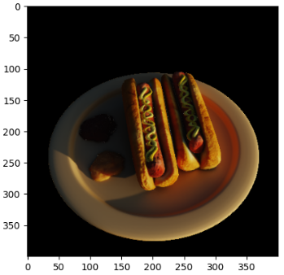
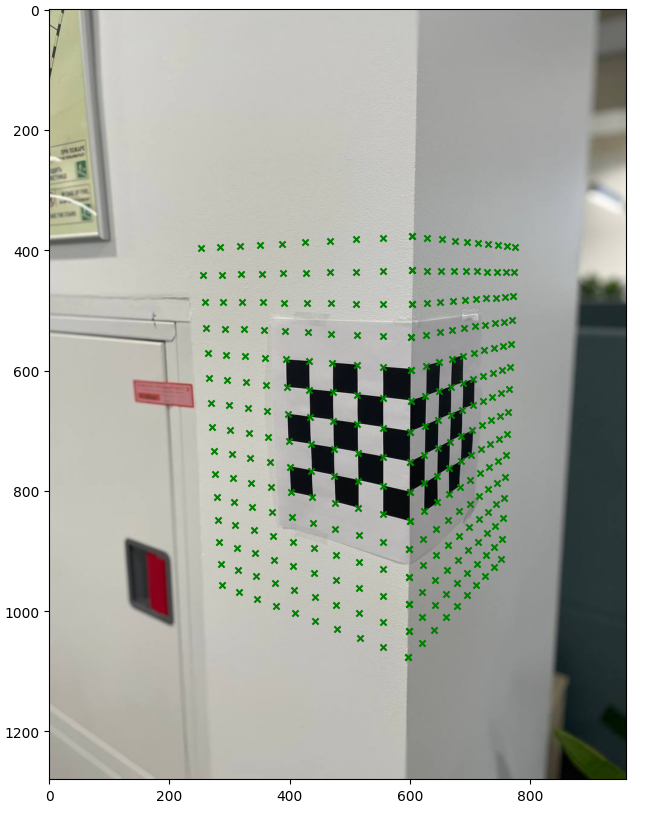

 # 3D Computer Vision From Scratch

Implementation of core 3D Vision and Neural Rendering algorithms in PyTorch and OpenCV.

This repository includes:

- Camera Calibration (PnP)
- Structure from Motion (SfM)
- Differentiable Rasterization
- Neural Radiance Fields (NeRF)

The project focuses on geometric computer vision, neural rendering, and differentiable graphics implemented from scratch for educational and research purposes.

---

# Preview

## Neural Radiance Fields


## Differentiable Rasterization


## Camera Calibration


---

# Implemented Methods

| Module | Key Methods |
|---|---|
| Camera Calibration | DLT, Levenberg-Marquardt, Projection Matrix Factorization |
| Structure from Motion | ORB, Lowe Ratio Test, RANSAC, Triangulation, PnP |
| Differentiable Rasterization | nvdiffrast, Texture Optimization, Differentiable Rendering |
| Neural Radiance Fields | Positional Encoding, Volume Rendering, Neural Scene Representation |

---

# Motivation

Modern AI systems increasingly combine computer vision, geometry, and neural rendering.

The goal of this project was to better understand how 3D scenes can be reconstructed and represented using both classical geometric methods and modern neural approaches such as Neural Radiance Fields.

All major components were implemented from scratch using NumPy, OpenCV, and PyTorch.

---

# Key Features

- Implemented geometric vision algorithms from scratch
- Built a full NeRF rendering pipeline in PyTorch
- Implemented volumetric rendering and ray sampling
- Worked with differentiable graphics using nvdiffrast
- Reconstructed 3D scenes from multi-view images
- Optimized camera poses using PnP and reprojection loss
- Learned continuous scene representations with neural rendering

---

# Quick Start

```bash
git clone https://github.com/DARIMAYA/Tasks_3D_CV.git
cd Tasks_3D_CV
pip install -r requirements.txt
```

---

# Camera Calibration (PnP)

Goal: Estimate the projection matrix from 2D-3D correspondences and decompose it into intrinsic and extrinsic camera parameters.

Implemented from scratch using NumPy and OpenCV.

## Pipeline

1. Build linear system:

A · m = 0

2. Estimate projection matrix using Direct Linear Transform (DLT)

3. Refine camera matrix using Levenberg-Marquardt optimization

4. Factorize projection matrix:

M = K [R | t]

where:

- K — intrinsic camera matrix
- R — rotation matrix
- t — translation vector

## Optimization Objective

Reprojection error minimization:

L(x_i, X_i) = Σ MX_i - x_i²

## Results

- Accurate camera calibration
- Low reprojection error
- Stable recovery of intrinsic parameters

---

# Structure from Motion (SfM)

Goal: Recover camera trajectories and sparse 3D scene structure from image sequences.

Implemented from scratch using OpenCV and NumPy.

## Pipeline

- ORB feature extraction
- Feature matching using Lowe ratio test
- Fundamental matrix estimation with RANSAC
- Track construction using Union-Find
- Triangulation of 3D points
- PnP pose estimation for unknown cameras

## Features

- Feature caching for faster processing
- Geometric outlier filtering
- Reprojection error validation
- Multi-view track reconstruction

## Results

- Stable camera trajectory estimation
- Sparse 3D reconstruction
- Robust pose estimation under noisy matches

---

# Differentiable Rasterization

Goal: Optimize mesh textures using differentiable rendering.

Implemented using PyTorch and nvdiffrast.

## Pipeline

- Rasterization of textured meshes
- UV interpolation
- Mipmap texture sampling
- Gradient-based texture optimization
- Anti-aliasing with differentiable rendering

## Optimization
Texture parameters are optimized directly using image reconstruction loss:

loss = F.mse_loss(rendered_image, target_image)
## Results

- Successful texture reconstruction
- Stable convergence during optimization
- Final texture MSE below 0.0012

---

# Neural Radiance Fields (NeRF)

Goal: Learn continuous volumetric scene representations from multi-view images.

Implemented from scratch using PyTorch.

## Implemented Components

- Positional encoding
- Ray generation
- Volume rendering
- Neural radiance field MLP
- Neural optimization with gradient descent

## Architecture

- Positional encoding (L=10)
- MLP:
  - 256 → 256 → 256 → 4
- RGB + density prediction

## Volume Rendering

NeRF integrates colors and densities along camera rays to synthesize novel views.

Volume rendering equation:

C(r) = Σ T_i (1 - e^{-σ_i δ_i}) c_i

where:

- σ_i — density
- c_i — color
- T_i — accumulated transmittance

## Results

- Novel view synthesis
- Continuous 3D scene representation
- Test MSE ≈ 0.00013 after training

---

# Results Summary

| Method | Metric | Value |
|---|---|---|
| Camera Calibration | Reprojection Error | < 0.5 px |
| SfM | Recovered Poses | ~95 / 100 |
| Differentiable Rasterization | Final MSE | 0.0011 |
| Vanilla NeRF | Test MSE | 0.00013 |

---

## Project Structure

```
Tasks_3D_CV/
│
├── camera_calibration/
│   ├── camera_calibration.ipynb
│   └── outputs/
│       ├── calibration_corners.png
│       └── grid.png
│
├── diff_rasterization/
│   ├── diff_rasterization.ipynb
│   └── outputs/
│       ├── result_omtimization_texture.png
│       ├── result_render_texture.png
│       └── total_result.png
│
├── nerf/
│   ├── nerf.ipynb
│   └── outputs/
│       ├── final_result.png
│       └── nerf_epoch_1.png
│
├── sfm/
│   ├── build.sh
│   ├── description.pdf
│   ├── estimate_trajectory.py
│   ├── run.py
│   ├── additonal_files/
│   │   ├── generate_point_cloud.py
│   │   └── common/
│   │       ├── absolute_translational_error.py
│   │       ├── dataset.py
│   │       ├── intrinsics.py
│   │       ├── point_cloud.py
│   │       ├── relative_pose_error.py
│   │       ├── testing.py
│   │       ├── trajectory.py
│   │       └── __init__.py
│   └── public_tests/
│       ├── 00_test_slam_gt/
│       │   ├── depth.txt
│       │   ├── ground_truth.txt
│       │   ├── known_poses.txt
│       │   └── depth/
│       │       └── 000000.png ... 000099.png  (100 frames)
│       ├── 00_test_slam_input/
│       │   ├── intrinsics.txt
│       │   ├── known_poses.txt
│       │   ├── rgb.txt
│       │   ├── rgb/
│       │   │   └── 000050.png ... 000099.png  (50 frames)
│       │   └── rgb_with_poses/
│       │       └── 000000.png ... 000049.png  (50 frames)
│       ├── 01_test_slam_gt/
│       │   ├── depth.txt
│       │   ├── ground_truth.txt
│       │   ├── known_poses.txt
│       │   └── depth/
│       │       └── 000000.png ... 000099.png  (100 frames)
│       ├── 01_test_slam_input/
│       │   ├── intrinsics.txt
│       │   ├── known_poses.txt
│       │   ├── rgb.txt
│       │   ├── rgb/
│       │   │   └── 000050.png ... 000099.png  (50 frames)
│       │   └── rgb_with_poses/
│       │       └── 000000.png ... 000049.png  (50 frames)
│       ├── 02_test_slam_gt/
│       │   ├── depth.txt
│       │   ├── ground_truth.txt
│       │   ├── known_poses.txt
│       │   └── depth/
│       │       └── 000000.png ... 000099.png  (100 frames)
│       └── 02_test_slam_input/
│           ├── intrinsics.txt
│           ├── known_poses.txt
│           ├── rgb.txt
│           ├── rgb/
│           │   └── 000050.png ... 000099.png  (50 frames)
│           └── rgb_with_poses/
│               └── 000000.png ... 000049.png  (50 frames)
│
├── assets/
│   ├── calibration_grid.png
│   ├── nerf_preview.png
│   └── texture_preview.png
│
├── requirements.txt
├── README.md
└── SOLUTION.md
```
# Results

Each module contains visual outputs and intermediate results.

## Camera Calibration

- detected corners
- projected calibration grid
- reprojection visualization

## Structure from Motion

- feature matches
- reconstructed camera poses
- sparse point clouds

## Differentiable Rasterization

- optimized textures
- rendered textured meshes
- texture convergence results

## NeRF

- rendered training views
- novel view synthesis
- rendered scene representations

---

# Technologies

- Python
- PyTorch
- OpenCV
- NumPy
- SciPy
- nvdiffrast
- trimesh
- xatlas

---


```bash
pip install numpy opencv-python matplotlib scipy torch torchvision trimesh xatlas ninja
pip install git+https://github.com/NVlabs/nvdiffrast.git
```

## References

- Hartley, Zisserman - "Multiple View Geometry"
- Mildenhall et al. - "NeRF: Representing Scenes as Neural Radiance Fields"
- NVlabs - nvdiffrast

---

## requirements.txt

```txt
numpy>=1.20
opencv-python>=4.5
matplotlib>=3.5
scipy>=1.10
torch>=2.0
torchvision
trimesh>=4.0
xatlas>=0.0.11
ninja>=1.10
nvdiffrast@git+https://github.com/NVlabs/nvdiffrast.git
```
